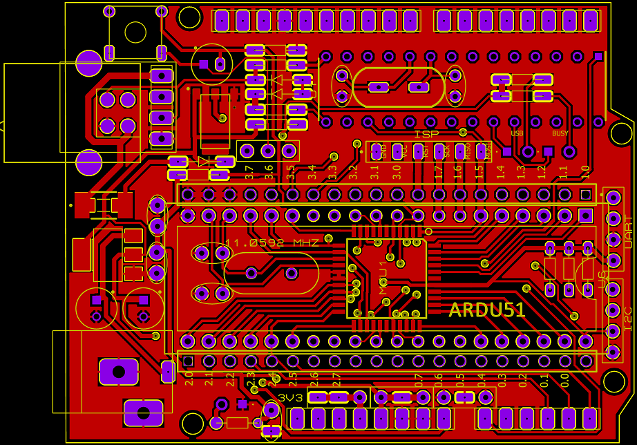
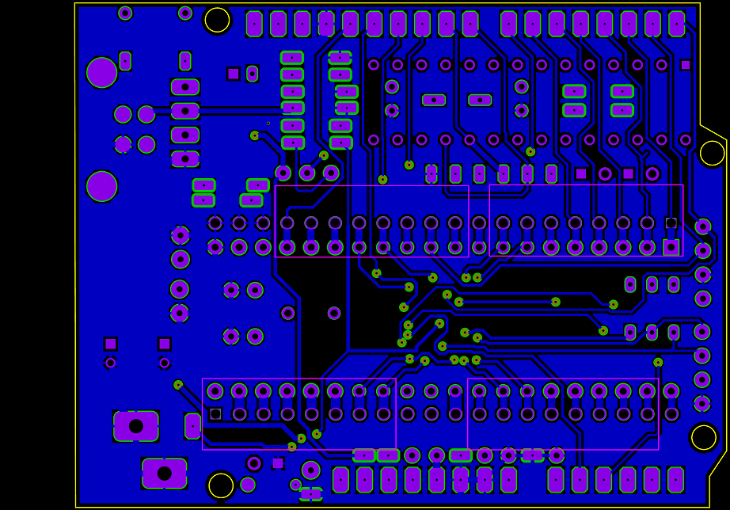

## ARDU-8051  

  <h1>An Arduino-Compatible Open-Source ATmel 8051 Hardware Shield</h1>

---

## 📌 Overview

ARDU-8051 is a low-cost, open-source, Arduino-compatible development board based on the ATmel 8051 microcontroller, featuring an integrated USBasp programmer. The platform is designed primarily for embedded systems education, enabling students and educators to explore classical 8051 architecture using a modern, simulation-first workflow, accessible hardware ecosystem.
  
This repository hosts all hardware designs, schematics, documentation, and lab materials required for academic and self-learning use.

## Motivation

The 8051 microcontroller remains a foundational component of embedded systems curricula worldwide due to its architectural simplicity and pedagogical value. However, traditional laboratory hardware is often outdated, expensive, or difficult to program.

ARDU-8051 addresses these challenges by:
- Reducing hardware and setup complexity  
- Integrating programming capability directly on the board  
- Adopting an Arduino-compatible form factor  
- Embracing open-source hardware principles  

---

## 🎯 Design Goals

- Preserve traditional 8051 pedagogy used in universities

- Provide simulation-to-hardware continuity

- Eliminate dependency on proprietary programmers

- Enable low-cost, reproducible laboratory setups

- Support both assembly-level learning and real hardware experimentation

The platform focuses on **conceptual clarity and hands-on learning**, rather than high-performance or industrial applications.

---
## 🧩 Platform Highlights

    -- AT89S52 (8051 core) with 11.0592 MHz crystal
    
    -- On-board USBasp programmer (ATmega8A, DIP)
    
    -- Dual USB option: Type-B or Type-C
    
    -- ADC0804 parallel analog-to-digital converter
    
    -- Buffered Port-0 bus using 74HC245
    
    -- Arduino UNO–compatible headers
    
    -- External 6-pin ISP header
    
    -- Designed for Proteus simulation + real hardware parity
---

## 🖼️ Hardware Architecture

Figure 1: Conceptual block diagram of the ARDU-8051 EDU-PRO platform.

  - 🔌 USBasp Programmer (On-board)

  - Implemented using ATmega8A (DIP package)
  
  - Fully compatible with AVRDUDE
  
  - Supports on-board programming and external ISP
  
  - USB Type-B / Type-C selectable footprint

---

## 🧪 Simulation-First Workflow

- Design and test circuits in Proteus ISIS

- Write 8051 assembly code using MIDE-51

- Generate HEX file

- Verify behavior in simulation

- Program real hardware using AVRDUDE + USBasp

---

## 🛠️ Software Toolchain
- Purpose	Tool
- Circuit Simulation	Proteus ISIS
- Assembly Programming	MIDE-51 Assembler
- Hardware Programming	AVRDUDE
- Programmer	USBasp

---

### 🚀 Quick Start (Blink LED)
  ### Requirements
  
  -- ARDU-8051 EDU-PRO board
  
  -- USB cable (Type-B or Type-C)
  
  -- Proteus, MIDE-51, AVRDUDE installed
  
  ### Steps
  
  -- Open provided Proteus schematic
  
  -- Assemble Blink LED code using MIDE-51
  
  -- Load HEX file into Proteus and verify blinking
  
  -- Connect board via USB
  
  -- Program using AVRDUDE:
  
  -- avrdude -c usbasp -p at89s52 -U flash:w:blink.hex
  
  -- Observe LED blinking on P1.0

  ---  

## 🧠 Educational Use

This platform is suitable for:

- Undergraduate microcontroller laboratories

- Introductory embedded systems courses

- Assembly language instruction

- ADC and peripheral interfacing experiments

---

## 🌍 Open-Source License

Hardware: CERN-OHL-S

Documentation: CC BY-SA 4.0

Firmware: MIT License
See the LICENSE file for details.

---

## 🤝 Contribution Guidelines

Contributions are welcome: hardware improvements, documentation corrections, additional lab experiments, simulation enhancements. Submit issues and pull requests via GitHub workflows.

---

## 🔧 Hardware Design

### 📐 Schematic Design

---

### 🖥️ PCB Design

---

## Hardware Views

---

### 🧱 3D Board Views

  
  
  

<b>Figure 2.</b> Top View, Bottom View and Schematic

---

## ⚠️ Limitations

ARDU-8051 is an **educational platform** and is not intended for:
- High-performance computing
- Industrial or safety-critical applications  

Design priorities are **simplicity, affordability, and teaching effectiveness**.

---

## 🚀 Future Work

Planned enhancements include:
- Example firmware (Assembly & C)
- Lab exercises and tutorials
- Minor hardware revisions based on feedback
- Community-contributed extensions

---

## 📜 License

This project is released under an **open-source hardware-compatible license**.  
See the `LICENSE` file for details.

---

### Maintainer
**Md. Golam Mostofa**  
GitHub: https://github.com/gmostofabd

