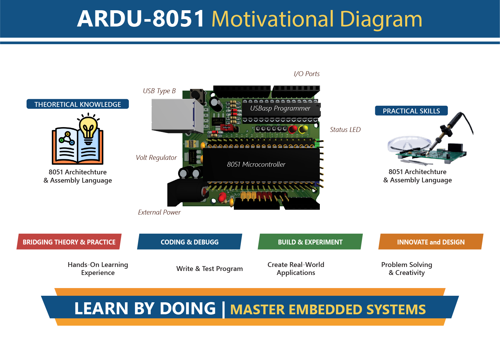

# 🚀 ARDU-8051  
### An Arduino-Compatible Open-Source 8051 Learning & Virtual Lab Platform

<!-- ===================== BADGES ===================== -->

<p align="center">

  <a href="https://opensource.org/osd">
    
  </a>

  <a href="https://en.wikipedia.org/wiki/Engineering_education">
    
  </a>

  <a href="https://en.wikipedia.org/wiki/Intel_MCS-51">
    
  </a>

  <a href="https://your-username.github.io/ARDU-8051/">
    
  </a>

  <a href="LICENSE">
    
  </a>

</p>

<!-- ===================== INTRO ===================== -->

<p align="center">
  <strong>ARDU-8051</strong> is an <b>open-source, Arduino-compatible hardware and virtual lab platform</b><br>
  designed for learning <b>8051 microcontroller architecture, assembly language, timers, interrupts, and interfacing</b>.
</p>

<p align="center">
  🔗 <a href="https://your-username.github.io/ARDU-8051/">Live Virtual Lab</a> |
  📘 <a href="docs/">Documentation</a> |
  🧪 <a href="experiments/">Experiments</a>
</p>

---
<div align="center" style="border: 2px solid #ddd; padding: 10px; border-radius: 10px; background-color: #f9f9f9; width: 80%; margin: auto;">

</div>

---

## 🌟 Motivation

<p align="justify">

The **ARDU-8051** project was motivated by a persistent reality in engineering education:

> **The 8051 microcontroller is still widely taught, but the tools used to teach it have not evolved accordingly.**

Across many universities, students continue to learn **8051 architecture, assembly language, timers, interrupts, and parallel I/O** using:

- Obsolete trainer boards  
- Proprietary or unavailable programmers  
- Fragmented workflows disconnected from simulation  
- Hardware that discourages experimentation  

At the same time, many modern platforms **hide low-level details**, making them unsuitable for foundational learning.

**ARDU-8051 bridges this gap by:**

- Reducing hardware and setup complexity  
- Integrating programming capability directly on the board  
- Adopting an Arduino-compatible form factor  
- Embracing open-source hardware and online experimentation  

</p>

<div align="center" style="border: 2px solid #ddd; padding: 12px; border-radius: 12px; background-color: #f5f7fa; width: 85%; margin: auto;">
  
</div>

---

## 🧩 Platform Highlights

- **8051 Core (AT89S52 compatible)**
- **Arduino UNO–style headers** for easy prototyping
- **On-board USB programmer** (no external hardware needed)
- **Supports Assembly Language learning**
- **Designed for simulation + real hardware parity**
- **Open-source schematics & documentation**

---

## 🧪 Virtual Lab Online

ARDU-8051 includes a **GitHub Pages–based Virtual Lab**, allowing learners to:

- Study experiments step-by-step  
- View circuit diagrams and block diagrams  
- Understand assembly code execution  
- Observe expected outputs  
- Use it for **remote learning, flipped classrooms, and self-study**

👉 **Live Lab:**  
🔗 https://gmostofabd.github.io/ARDU-8051/

---

## 🧪 Experiment Index

All experiments are designed for **concept clarity**, **assembly language practice**, and **hardware understanding**.

| # | Experiment | Topic |
|---|-----------|------|
| 01 | LED Blinking using Timer | Timers |
| 02 | 7-Segment Display Interface | I/O |
| 03 | Multiplexed 4-Digit 7-Segment | Multiplexing |
| 04 | 4×4 Keypad with LCD | Interfacing |
| 05 | DC Motor Control | Control |
| 06 | Stepper Motor Control | Sequencing |
| 07 | Servo Motor Control | PWM |
| 08 | 8×8 LED Matrix | Scanning |

📂 See full list: [`/experiments`](experiments/)

---

## 📁 Repository Structure

```text
ARDU-8051/
│
├── docs/                 # Documentation & diagrams
│   └── images/
│
├── experiments/          # Virtual lab experiments
│   ├── index.md
│   ├── 01-led-blink.md
│   ├── 02-seven-segment.md
│   └── ...
│
├── firmware/             # Assembly source codes
├── hardware/             # Schematics & PCB files
├── assets/               # Images & media
├── LICENSE
└── README.md
