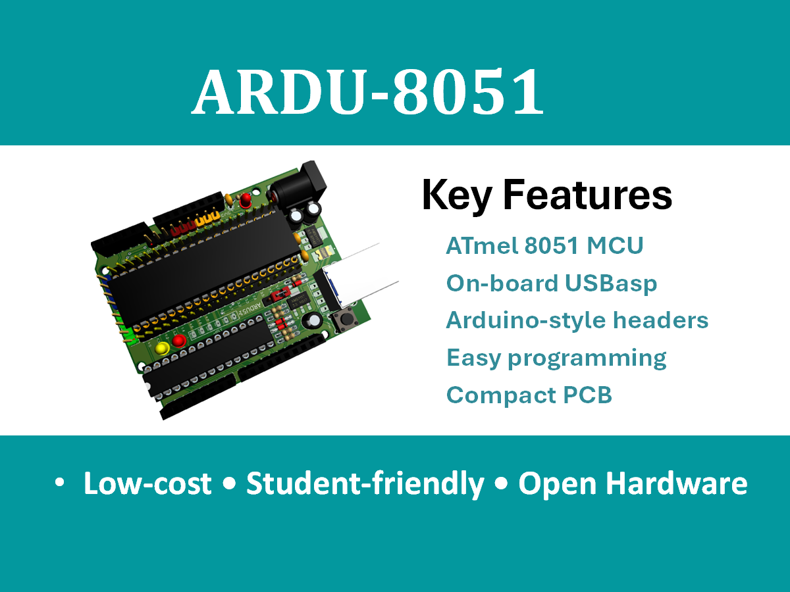

## ARDU-8051  

  <h1>An Arduino-Compatible Open-Source ATmel 8051 Hardware Shield</h1>

---

## 📌 Overview

ARDU-8051 is a low-cost, open-source, Arduino-compatible development board based on the ATmel 8051 microcontroller, featuring an integrated USBasp programmer. The platform is designed primarily for embedded systems education, enabling students and educators to explore classical 8051 architecture using a modern, simulation-first workflow, accessible hardware ecosystem.
  
This repository hosts all hardware designs, schematics, documentation, and lab materials required for academic and self-learning use.

## Motivation

The 8051 microcontroller remains a foundational component of embedded systems curricula worldwide due to its architectural simplicity and pedagogical value. However, traditional laboratory hardware is often outdated, expensive, or difficult to program.

ARDU-8051 addresses these challenges by:
- Reducing hardware and setup complexity  
- Integrating programming capability directly on the board  
- Adopting an Arduino-compatible form factor  
- Embracing open-source hardware principles  

---

## 🎯 Design Goals

Preserve traditional 8051 pedagogy used in universities

Provide simulation-to-hardware continuity

Eliminate dependency on proprietary programmers

Enable low-cost, reproducible laboratory setups

Support both assembly-level learning and real hardware experimentation

---
## 🧩 Platform Highlights

    -- AT89S52 (8051 core) with 11.0592 MHz crystal
    
    -- On-board USBasp programmer (ATmega8A, DIP)
    
    -- Dual USB option: Type-B or Type-C
    
    -- ADC0804 parallel analog-to-digital converter
    
    -- Buffered Port-0 bus using 74HC245
    
    -- Arduino UNO–compatible headers
    
    -- External 6-pin ISP header
    
    -- Designed for Proteus simulation + real hardware parity
---

## Educational Scope

ARDU-8051 is intended for:
- Undergraduate embedded systems laboratories  
- Introductory microcontroller courses  
- Self-learning and experimentation  
- Training workshops and demonstrations  

The platform focuses on **conceptual clarity and hands-on learning**, rather than high-performance or industrial applications.

---

## 🖼️ Hardware Architecture

Figure 1: Conceptual block diagram of the ARDU-8051 EDU-PRO platform.

🔌 USBasp Programmer (On-board)

Implemented using ATmega8A (DIP package)

Fully compatible with AVRDUDE

Supports on-board programming and external ISP

USB Type-B / Type-C selectable footprint
---

## 🧪 Simulation-First Workflow

Design and test circuits in Proteus ISIS

Write 8051 assembly code using MIDE-51

Generate HEX file

Verify behavior in simulation

Program real hardware using AVRDUDE + USBasp

## 🛠️ Software Toolchain
Purpose	Tool
Circuit Simulation	Proteus ISIS
Assembly Programming	MIDE-51 Assembler
Hardware Programming	AVRDUDE
Programmer	USBasp

### 🚀 Quick Start (Blink LED)
  Requirements
  
  ARDU-8051 EDU-PRO board
  
  USB cable (Type-B or Type-C)
  
  Proteus, MIDE-51, AVRDUDE installed
  
  Steps
  
  Open provided Proteus schematic
  
  Assemble Blink LED code using MIDE-51
  
  Load HEX file into Proteus and verify blinking
  
  Connect board via USB
  
  Program using AVRDUDE:
  
  avrdude -c usbasp -p at89s52 -U flash:w:blink.hex
  
  Observe LED blinking on P1.0

## 📁 Repository Structure
    ARDU-8051/
    ├── hardware/
    │ ├── schematics/
    │ ├── pcb/
    │ └── bom/
    ├── docs/
    │ ├── user-manual/
    │ ├── student-lab-manual/
    │ ├── instructor-manual/
    │ └── images/
    ├── firmware/
    │ ├── assembly-examples/
    │ └── hex-files/
    ├── simulation/
    │ └── proteus-projects/
    ├── LICENSE
    └── README.md
## 📘 Documentation

User Manual – Board operation and workflow

Student Lab Manual – Step-by-step experiments

Instructor Manual – Solutions, waveforms, rubrics

IEEE Platform Description – Academic publication-ready text

All documents are located in the /docs directory.

## 🧠 Educational Use

This platform is suitable for:

Undergraduate microcontroller laboratories

Introductory embedded systems courses

Assembly language instruction

ADC and peripheral interfacing experiments

## 🌍 Open-Source License

This project is released as open-source hardware and documentation.

Recommended License:

Hardware: CERN-OHL-S

Documentation: CC BY-SA 4.0

Firmware: MIT License

See the LICENSE file for details.

## 🤝 Contribution Guidelines

Contributions are welcome:

Hardware improvements

Documentation corrections

Additional lab experiments

Simulation enhancements

Please submit issues and pull requests using standard GitHub workflows.

📖 Citation

If you use this platform in academic work, please cite:

G. Mostofa, "ARDU-8051 EDU-PRO: An Open-Source Educational Platform for 8051 Microcontroller Learning," 2026.
## ⭐ Acknowledgment

This project was developed to support accessible, concept-driven microcontroller education, particularly in academic environments where 8051 remains a core teaching platform.

## 📁 docs/images/ — Required Image Filename List
docs/images/
├── ardu-8051-board.png
├── block-diagram.png
├── usbasp-schematic.png
├── proteus-simulation.png

## 🖼️ Image Purpose & Caption Mapping (IMPORTANT)
## 1️⃣ ardu-8051-board.png

Used in: README header (hero image)

Description:

Full ARDU-8051 EDU-PRO board

Top view

Clearly visible ICs, USB connector, headers

Recommended specs:

Resolution: 1600×900 or higher

Background: white or light gray

Style: real photo or clean render

## 2️⃣ block-diagram.png

Used in: Hardware Architecture section

Caption in README:

Figure 1: Conceptual block diagram of the ARDU-8051 EDU-PRO platform.

Should include blocks for:

AT89S52 (8051 Core)

USBasp (ATmega8A)

ADC0804

74HC245 Buffer

USB Interface

Arduino Headers

Style:

Vector diagram (Inkscape / draw.io / PowerPoint)

Sans-serif font

IEEE-style arrows

## 3️⃣ usbasp-schematic.png

Used in: USBasp Programmer (On-board) section

Should show:

ATmega8A (DIP)

USB D+ / D−

Crystal

ISP headers

USB Type-B / Type-C option

Power filtering

Source:

Exported from Proteus

Or redrawn cleanly for publication

## 4️⃣ proteus-simulation.png

Used in: Simulation-First Workflow section

Should show:

Proteus ISIS schematic

AT89S52 loaded with HEX file

LED blinking or ADC experiment

Logic probe / oscilloscope (optional)

Purpose:
Demonstrates simulation → hardware parity

## ✅ Naming Rules (DO NOT CHANGE)

Lowercase only

Hyphen-separated

.png format

No spaces

No version numbers in filenames

This ensures:

GitHub compatibility

Markdown reliability

Long-term citation safety

## 📌 Optional (Future Expansion – NOT required now)

If later needed, you may add:

docs/images/
├── pcb-top.png
├── pcb-bottom.png
├── pinout-diagram.png
├── adc0804-timing.png
├── lab-setup-photo.png

##v 🎯 Academic Tip (Important)

Use the same filenames in:

GitHub README

IEEE paper figures

ResearchGate uploads

Lab manuals

This consistency signals professional engineering discipline.

## 🔧 Hardware Design

### 📐 Schematic Design

- Designed using **Proteus Design Suite**
- Follows standard 8051 reference architectures
- Includes reliable reset and clock circuitry
- ISP signals routed for stable programming

📁 Full schematic files are available in the repository.

---

### 🖥️ PCB Design

- Compact PCB layout
- Arduino-compatible shield form factor
- Optimized for low-cost fabrication
- Clear signal routing and power integrity

---

### 🧱 3D Board Views

3D renders are provided to support:
- Hardware understanding
- Remote learning
- Pre-assembly visualization

---

## 💻 Programming Workflow

1. Write firmware in **8051 Assembly or C**
2. Compile using standard 8051 toolchains
3. Upload firmware via **on-board USBasp**
4. Run and test directly on hardware

This workflow preserves **low-level embedded concepts** while minimizing setup complexity.

---

## 📂 Repository Structure

## 📚 Academic Reference

This project is described in a **ResearchGate Method publication**.

> If you use ARDU-8051 in teaching, research, or derivative work, citation is appreciated.

(You may add your DOI here.)

---

## ⚠️ Limitations

ARDU-8051 is an **educational platform** and is not intended for:
- High-performance computing
- Industrial or safety-critical applications  

Design priorities are **simplicity, affordability, and teaching effectiveness**.

---

## 🚀 Future Work

Planned enhancements include:
- Example firmware (Assembly & C)
- Lab exercises and tutorials
- Minor hardware revisions based on feedback
- Community-contributed extensions

---

## 📜 License

This project is released under an **open-source hardware-compatible license**.  
See the `LICENSE` file for details.

---

## 🤝 Contribution & Collaboration

Contributions, feedback, and academic collaboration are welcome.

If you are an **educator**, **student**, or **researcher** using ARDU-8051, feel free to:
- Open issues
- Suggest improvements
- Share classroom experiences

---

### Maintainer
**Md. Golam Mostofa**  
GitHub: https://github.com/gmostofabd

